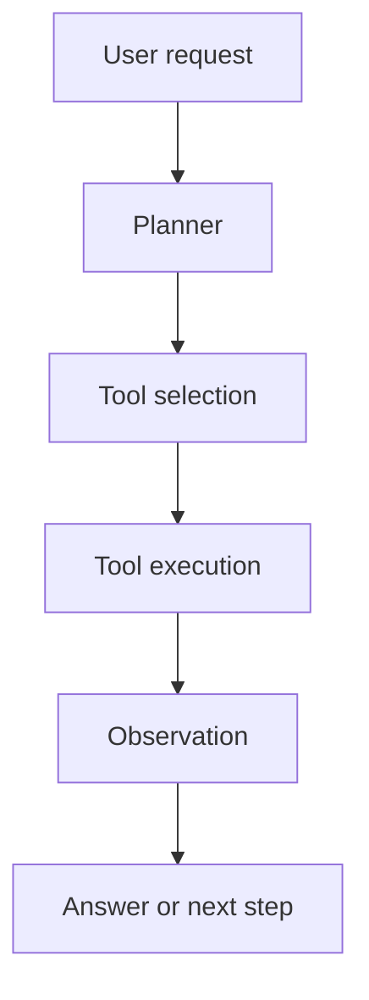
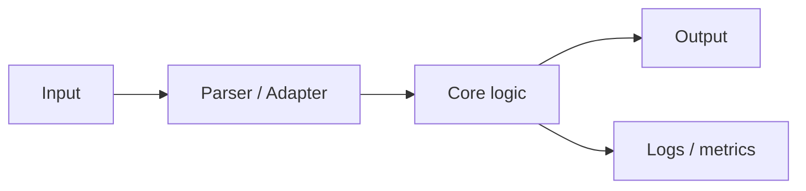

*Caption: TODO: Replace this with a screenshot, diagram, trace, benchmark chart, or concept map.*

TODO: Opening paragraph. Say what this post is about, why it matters, and which parts below you kept. Delete the categories and sections that do not fit this post before publishing.

## 🤖 Agent

Use this category for LLM agents, workflow automation, RAG, memory, tool calling, evaluation, prompt design, and agent project writeups.

### 🎯 Goal

- **Task:** TODO
- **Agent role:** TODO
- **Input:** TODO
- **Expected output:** TODO
- **Success criteria:** TODO

### 🧭 Background

TODO: Explain why this agent workflow is needed, where it will be used, and what problem it solves.

> **Key point:** TODO: Put the central design idea here.

### 🧩 Workflow Design



### 📝 Prompt / Policy

```text
TODO: Paste the important prompt, policy, or instruction block.
Keep only the part that explains the behavior being tested.
```

### 🛠️ Tools And Interfaces

| Tool | Input | Output | Failure case |
| --- | --- | --- | --- |
| TODO | TODO | TODO | TODO |
| TODO | TODO | TODO | TODO |

```ts
type AgentStep = {
  thought: string;
  action: string;
  observation?: string;
};

type AgentResult = {
  answer: string;
  steps: AgentStep[];
};
```

### 🧠 Memory / Retrieval

- **Knowledge source:** TODO
- **Chunking strategy:** TODO
- **Retrieval query:** TODO
- **Reranking rule:** TODO
- **What should be remembered:** TODO

### 🔬 Experiment Setup

1. TODO: Prepare test data.
2. TODO: Run baseline.
3. TODO: Run improved workflow.
4. TODO: Compare outputs.

### 📊 Evaluation

| Case | Expected | Actual | Pass | Notes |
| --- | --- | --- | --- | --- |
| TODO | TODO | TODO | TODO | TODO |
| TODO | TODO | TODO | TODO | TODO |

### ⚠️ Failure Modes

- TODO: Hallucinated tool result.
- TODO: Missing context.
- TODO: Bad stopping condition.
- TODO: Over-planning.

### 🧪 Trace / Example

```text
User:
TODO

Agent thought:
TODO

Tool call:
TODO

Observation:
TODO

Final answer:
TODO
```

### 📊 Results & Impact

- **Accuracy:** TODO
- **Latency:** TODO
- **Cost:** TODO
- **User feedback:** TODO
- **What changed after this experiment:** TODO

### 🔗 Links

- [Source Code](https://example.com)
- [Experiment Log](https://example.com)
- [Reference](https://example.com)

### ✅ Agent Summary

- TODO: What worked.
- TODO: What failed.
- TODO: What to test next.

## 💻 C++ && Linux

Use this category for C++ notes, Linux debugging, system programming, backend internals, command-line workflows, build systems, performance, and engineering project writeups.

### 🧾 Context

- **Scenario:** TODO
- **Environment:** TODO: OS, compiler, kernel, shell, library versions.
- **Goal:** TODO
- **Main takeaway:** TODO

### 🔎 Problem

TODO: Describe the symptom, bug, implementation need, or question.

```bash
uname -a
g++ --version
ldd --version
```

### 🧠 Core Idea

TODO: Explain the mechanism in plain language before showing code.

> **Pitfall:** TODO: Boundary condition, undefined behavior, permissions issue, shell quoting issue, or version mismatch.

### 🧪 Minimal Reproduction

```cpp
#include <iostream>

int main() {
  std::cout << "TODO" << '\n';
  return 0;
}
```

```bash
g++ -std=c++20 main.cpp -o demo
./demo
```

### 🛠️ Project / Module Overview

- **Module:** TODO
- **Responsibility:** TODO
- **Inputs:** TODO
- **Outputs:** TODO
- **Dependencies:** TODO

### 🧰 Technologies Used

| Layer | Choice | Reason |
| --- | --- | --- |
| Language | C++20 | TODO |
| OS / Runtime | Linux | TODO |
| Build | TODO | TODO |
| Debugging | TODO | TODO |

### 🌟 Key Features

1. **TODO Feature One:** TODO
2. **TODO Feature Two:** TODO
3. **TODO Feature Three:** TODO

### 🧩 Architecture



### ⌨️ Essential Commands

```bash
# Build
cmake -S . -B build
cmake --build build

# Inspect
strace -f ./demo
ltrace ./demo

# Debug
gdb ./demo
```

### 🐞 Debugging Notes

1. **Observation:** TODO
2. **Hypothesis:** TODO
3. **Check:** TODO
4. **Result:** TODO

### ⚡ Performance

| Metric | Before | After | Notes |
| --- | --- | --- | --- |
| Runtime | TODO | TODO | TODO |
| Memory | TODO | TODO | TODO |
| Binary size | TODO | TODO | TODO |

### 🌐 Platform Support

| Platform | Status | Notes |
| --- | --- | --- |
| Ubuntu | TODO | TODO |
| WSL | TODO | TODO |
| Remote server | TODO | TODO |

### 🧪 Tests

```bash
# TODO: Replace with real test commands.
ctest --test-dir build --output-on-failure
```

```text
Case 1:
TODO

Edge case:
TODO
```

### 🌿 Git / Workflow Notes

```bash
git status
git diff
git add .
git commit -m "feat: TODO"
```

- **Branch naming:** TODO
- **Atomic commit boundary:** TODO
- **Review checklist:** TODO

### ❗ Common Mistakes To Avoid

- TODO: Forgetting ownership / lifetime rules.
- TODO: Mixing signed and unsigned indexes.
- TODO: Ignoring return codes.
- TODO: Assuming the same behavior across environments.

### 📊 Results & Impact

- **What improved:** TODO
- **What stayed the same:** TODO
- **What still needs work:** TODO

### 🔗 Links

- [Source Code](https://example.com)
- [Documentation](https://example.com)
- [Reference](https://example.com)

### ✅ C++ && Linux Summary

- TODO: What worked.
- TODO: What failed.
- TODO: What to remember next time.

## 🧠 Algorithm

Use this category for problem solving, data structures, dynamic programming, graph algorithms, greedy proofs, complexity analysis, and reusable problem patterns.

### 🧾 Problem Statement

TODO: State the problem in one paragraph. Include input, output, constraints, and what makes it non-trivial.

### 🔍 Example

```text
Input:
TODO

Output:
TODO

Reason:
TODO
```

### 🧭 Pattern

- **Type:** TODO: DP / graph / greedy / binary search / data structure.
- **Key observation:** TODO
- **Invariant:** TODO
- **Answer form:** TODO

### ✨ Main Idea

TODO: Explain the algorithm before code.

> **Proof sketch:** TODO: Explain why the idea is correct.

### 🧩 State / Data Structure

| Name | Meaning | Update rule |
| --- | --- | --- |
| TODO | TODO | TODO |
| TODO | TODO | TODO |

### 🔁 Transition / Procedure

1. TODO: Initialize.
2. TODO: Iterate.
3. TODO: Update state.
4. TODO: Extract answer.

### ⚖️ Comparison / Decision Guide

| Approach | Pros | Cons | Use when |
| --- | --- | --- | --- |
| Brute force | Easy to verify | Slow | TODO |
| Optimized | Faster | More complex | TODO |
| Alternative | TODO | TODO | TODO |

### 🧮 Complexity

| Part | Complexity |
| --- | --- |
| Time | TODO: O(...) |
| Space | TODO: O(...) |

### 💻 C++ Implementation

```cpp
#include <bits/stdc++.h>
using namespace std;

class Solution {
public:
  int solve(vector<int>& nums) {
    // TODO: Replace with the final implementation.
    return 0;
  }
};
```

### 🧪 Tests

```text
Case 1:
TODO

Case 2:
TODO

Edge case:
TODO
```

### ⚠️ Common Pitfalls

- TODO: Off-by-one.
- TODO: Empty input.
- TODO: Overflow.
- TODO: Wrong sorting order.
- TODO: Reusing stale state.

### 📚 Related Problems / References

- [TODO: Related problem](https://example.com)
- [TODO: Explanation](https://example.com)

### ✅ Algorithm Summary

- TODO: Main idea.
- TODO: Why it is correct.
- TODO: When to reuse this pattern.

### 🏁 Final Cleanup Before Publishing

- [ ] Delete unused categories.
- [ ] Keep at least one tag from `C++ && Linux`, `Agent`, or `Algorithm`.
- [ ] Replace `TODO` placeholders.
- [ ] Replace the cover image and caption if needed.
- [ ] Change `draft: true` to `draft: false`.
- [ ] Run the site build.
