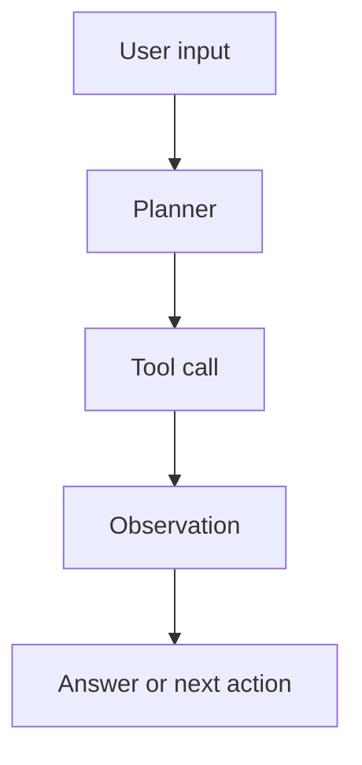

*Caption: TODO: Replace this with an agent workflow diagram, trace screenshot, or evaluation chart.*

TODO: Start with the question: what agent behavior did you want to build or test?

## 🤖 Experiment Goal

- **Task:** TODO
- **Agent role:** TODO
- **Tools:** TODO
- **Success criteria:** TODO

## 🧩 Workflow Design

TODO: Describe the loop: input, planning, tool calls, observations, final answer.



## 📝 Prompt / Policy

```text
TODO: Paste the important prompt or policy block here.
Keep only the part that explains the behavior being tested.
```

## 🔧 Implementation Notes

```ts
type AgentStep = {
  thought: string;
  action: string;
  observation?: string;
};

// TODO: Replace with the real interface, pseudo-code, or trace parser.
```

## 📊 Evaluation

| Case | Expected | Actual | Pass |
| --- | --- | --- | --- |
| TODO | TODO | TODO | TODO |
| TODO | TODO | TODO | TODO |

## ⚠️ Failure Modes

- TODO: Hallucinated tool result.
- TODO: Over-planning.
- TODO: Missing context.
- TODO: Bad stopping condition.

## ✅ Takeaways

1. TODO: What improved the agent?
2. TODO: What did not help?
3. TODO: What should be tested next?

