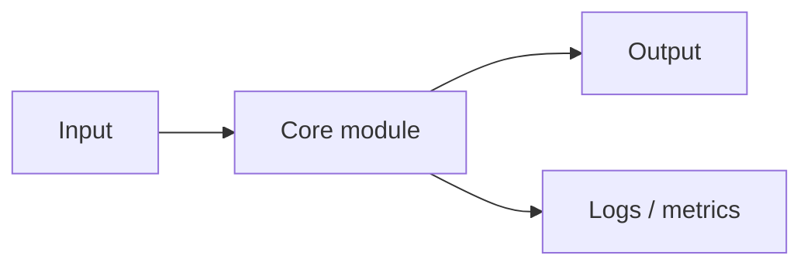

*Caption: TODO: Replace this with a screenshot, architecture diagram, demo GIF, or result image.*

TODO: Start with the motivation. What problem did this project solve?

## 🧾 Project Overview

- **Name:** TODO
- **Type:** TODO: tool / demo / library / system / experiment.
- **Status:** TODO: prototype / usable / archived / maintained.
- **Repository:** [TODO](https://example.com)
- **Demo:** [TODO](https://example.com)

## 🛠️ Technologies Used

| Layer | Choice | Reason |
| --- | --- | --- |
| Frontend | TODO | TODO |
| Backend | TODO | TODO |
| Storage | TODO | TODO |
| Deployment | TODO | TODO |

## 🌟 Key Features

1. **TODO Feature One:** TODO
2. **TODO Feature Two:** TODO
3. **TODO Feature Three:** TODO

## 🧩 Architecture

## 🔥 Challenges & Solutions

### Challenge 1: TODO

TODO: Explain the challenge.

**Solution:** TODO

### Challenge 2: TODO

TODO: Explain the challenge.

**Solution:** TODO

## 📊 Results & Impact

- **Metric:** TODO
- **User feedback:** TODO
- **What I learned:** TODO

## 🔗 Links

- [Live Demo](https://example.com)
- [Source Code](https://example.com)
- [Documentation](https://example.com)

## ✅ Next Steps

- [ ] TODO
- [ ] TODO
- [ ] TODO

